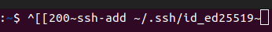

## Troubleshoot

- Custom environment variable not automatically sourced in `~/.bash_profile`.
    1. Open terminal and type `cd ~ && open .bashrc`.
    2. Scroll down the text editor and put `. ~/.bash_profile` at the bottom of it.
    3. Save the file.
    4. Re-open terminal and check the if it works.

    Source:-
    - https://askubuntu.com/questions/121073/why-bash-profile-is-not-getting-sourced-when-opening-a-terminal

---
- Copied text from somewhere but got extra trash in it when paste in terminal.
    
    
    1. Open terminal and type `cd ~ && open .bashrc`.
    2. Scroll down the text editor and put below code at the bottom of it.
        ```
        # Disable bracketed paste mode
        if [[ $- == *i* ]]; then
            bind 'set enable-bracketed-paste off'
        fi
        ```
    3. Save the file.
    4. Re-open terminal and try copy text from somewhere and paste into the terminal.

    Source:-
    - https://superuser.com/questions/1532688/pasting-required-text-into-terminal-emulator-results-in-200required-text
    - https://askubuntu.com/questions/662222/why-bracketed-paste-mode-is-enabled-sporadically-in-my-terminal-screen

---